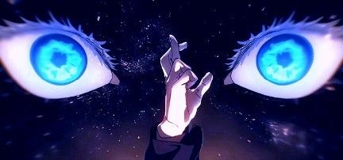
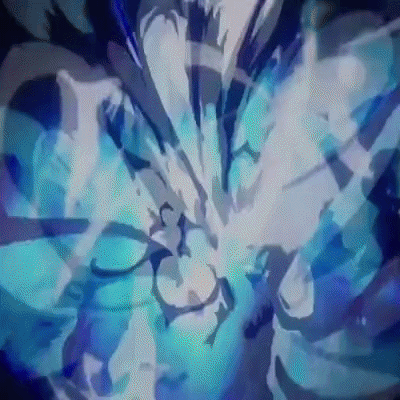
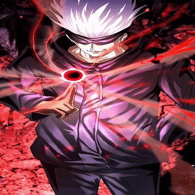
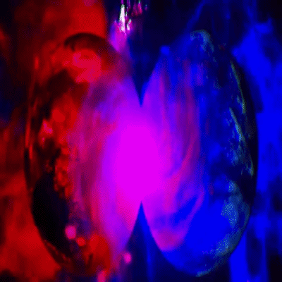
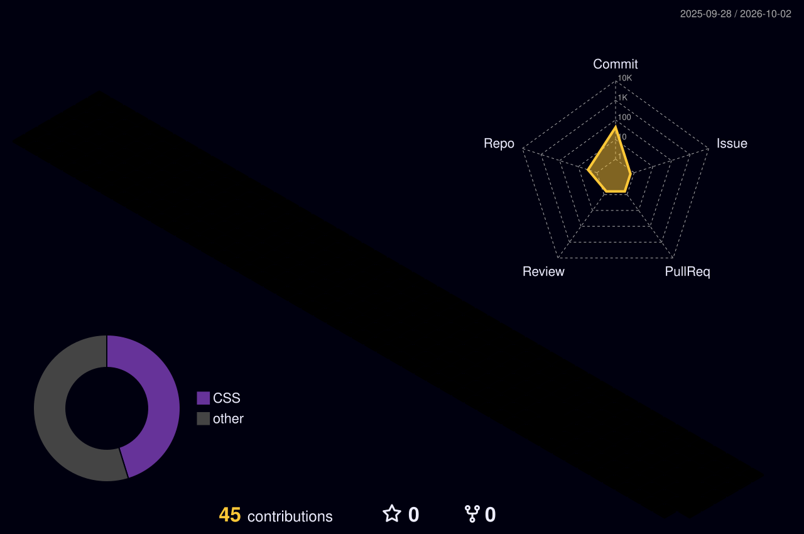

<!--
  ╔════════════════════════════════════════════════════════════════════╗
  ║  TODO ПЕРЕД ПУБЛИКАЦИЕЙ — замени плейсхолдеры (Ctrl+F):            ║
  ║                                                                    ║
  ║  DISCORD_ID          — числовой ID аккаунта Discord                ║
  ║  YOUR_*_PLAYLIST     — ссылки на твои плейлисты                    ║
  ║  utcOffset=0         — твой сдвиг от UTC (карточка Productive Time)║
  ║                                                                    ║
  ║  Файлы в assets/: banner.png, gojo-blue.gif, gojo-red.gif,         ║
  ║                   gojo-purple.gif                                  ║
  ║                                                                    ║
  ║  НЕ УДАЛЯЙ маркеры START_SECTION / END_SECTION (activity) в        ║
  ║  разделе Recent Activity — их использует activity.yml.             ║
  ║  Этот комментарий на странице профиля не виден, можно оставить.    ║
  ╚════════════════════════════════════════════════════════════════════╝
-->

<div align="center">



<a href="https://github.com/ToxicStyle-DevXplorer">
  
</a>

<br/>


</div>

<br/>

> *«Не волнуйся. Я ведь сильнейший.»* — **Годжо Сатору**

---

## 👁️ Техники — Синий · Красный · Фиолетовый

<div align="center">
<table>
  <tr>
    <td align="center" width="33%" valign="top">
      
      <br/><br/>
      
      <h3>蒼 — Синий</h3>
      <sub><b>Cursed Technique Lapse: Blue</b></sub>
      <p>Проклятая техника «Синий»: Бесконечность, доведённая до максимума притяжения. Тянет всё в одну точку.</p>
      <p><i>Dev-перевод: притягивает зависимости, дедлайны и баги.</i></p>
    </td>
    <td align="center" width="33%" valign="top">
      
      <br/><br/>
      
      <h3>赤 — Красный</h3>
      <sub><b>Cursed Technique Reversal: Red</b></sub>
      <p>Возврат проклятой техники «Красный»: обращённая техника, которая с огромной силой отталкивает и разрывает цель.</p>
      <p><i>Dev-перевод: <code>git push --force</code> — отталкивает всех коллег разом.</i></p>
    </td>
    <td align="center" width="33%" valign="top">
      
      <br/><br/>
      
      <h3>茈 — Фиолетовый</h3>
      <sub><b>Colliding Chaos / Hollow Purple</b></sub>
      <p>Мнимая техника «Фиолетовый»: столкновение Красного и Синего порождает массу, стирающую всё на пути.</p>
      <p><i>Dev-перевод: merge-конфликт, который удалил прод. Красиво, но больно.</i></p>
    </td>
  </tr>
  <tr>
    <td colspan="3" align="center">
      <br/>
      
      <h3>無量空処 — Расширение территории: Бесконечная пустота</h3>
      <sub><b>Domain Expansion: Unlimited Void</b></sub>
      <p>Цель оказывается внутри потока бесконечной информации и теряет способность двигаться и думать.</p>
      <p><i>Dev-перевод: открыл документацию по Kubernetes и пропал на три часа.</i></p>
      <br/>
    </td>
  </tr>
</table>
</div>

---

## 🛠️ Tech Stack

<div align="center">

**Языки**


**Фреймворки, данные, инфраструктура**


**Окружение и инструменты**


</div>

---

## 🖥️ Terminal — Arch Linux

<div align="center">
  
</div>

```text
      /\                 toxic@archlinux
     /  \                ---------------
    /\   \               OS:        Arch Linux x86_64
   /      \              WM:        Hyprland (Wayland)
  /   ,,   \             Shell:     Zsh
 /   |  |  -\            Terminal:  Kitty
/_-''    ''-_\           Editor:    Neovim · VS Code
                         Keyboard:  Corne Split (ZMK, Wireless)
                         Technique: Blue · Red · Purple
                         Domain:    Unlimited Void
                         Status:    the strongest
                         ███ ███ ███ ███ ███ ███ ███ ███
```

---

## 📊 Статистика

<div align="center">


<br/>


<br/><br/>


</div>

### ⏱️ WakaTime — Coding Activity

<div align="center">
  
</div>

### 🌗 Когда я пишу код (Productive Time)

<div align="center">
  
</div>

### ⚔️ Codewars

<div align="center">

<a href="https://www.codewars.com/users/ToxicStyle-DevXplorer">
  
</a>

<br/><br/>

<a href="https://www.codewars.com/users/ToxicStyle-DevXplorer">
  
</a>

</div>

---

## 🐍 Змейка пожирает мои коммиты

<div align="center">
  <picture>
    <source media="(prefers-color-scheme: light)" srcset="https://raw.githubusercontent.com/ToxicStyle-DevXplorer/ToxicStyle-DevXplorer/output/github-snake.svg"/>
    <source media="(prefers-color-scheme: dark)" srcset="https://raw.githubusercontent.com/ToxicStyle-DevXplorer/ToxicStyle-DevXplorer/output/github-snake-neon.svg"/>
    
  </picture>
</div>

## 🧊 3D-график активности

<div align="center">
  
</div>

## 🔄 Recent Activity

<!-- activity:START -->
- [ToxicStyle-DevXplorer pushed ToxicStyle-DevXplorer](https://github.com/ToxicStyle-DevXplorer/ToxicStyle-DevXplorer/compare/e996941753...8c1123d1fa)
- [ToxicStyle-DevXplorer pushed ToxicStyle-DevXplorer](https://github.com/ToxicStyle-DevXplorer/ToxicStyle-DevXplorer/compare/635b1aaa8d...e996941753)
- [ToxicStyle-DevXplorer pushed ToxicStyle-DevXplorer](https://github.com/ToxicStyle-DevXplorer/ToxicStyle-DevXplorer/compare/d975cc2f11...c29a4ee136)
- [ToxicStyle-DevXplorer pushed ToxicStyle-DevXplorer](https://github.com/ToxicStyle-DevXplorer/ToxicStyle-DevXplorer/compare/2073ec223b...4b7f5609cf)
- [ToxicStyle-DevXplorer pushed ToxicStyle-DevXplorer](https://github.com/ToxicStyle-DevXplorer/ToxicStyle-DevXplorer/compare/05e982c3d5...f7889a99b4)
<!-- activity:END -->

---

## 🎧 Что играет сейчас

### Live — Discord Rich Presence (Lanyard)

<div align="center">
  <a href="https://discord.com/users/DISCORD_ID">
    
  </a>
</div>

### Мои плейлисты

<div align="center">

<a href="https://music.youtube.com/playlist?list=YOUR_YOUTUBE_MUSIC_PLAYLIST"></a>
<a href="https://soundcloud.com/YOUR_SOUNDCLOUD_PLAYLIST"></a>
<a href="https://music.yandex.ru/users/YOUR_YANDEX_USER/playlists/YOUR_PLAYLIST_ID"></a>
<a href="https://music.apple.com/playlist/YOUR_APPLE_MUSIC_PLAYLIST"></a>

</div>

---

## 🔮 Спойлеры

<details>
<summary><b>⌨️ Рабочий сетап</b></summary>
<br/>

| Компонент | Что используется |
|-----------|------------------|
| 🐧 ОС | Arch Linux |
| 🪟 WM | Hyprland (Wayland) |
| ⌨️ Клавиатура | Corne Split Keyboard (ZMK Firmware, Wireless) |
| 💻 Терминал / Shell | Kitty / Zsh |
| 📝 Редакторы | Neovim, VS Code |
| 🎨 Дизайн | Figma |

</details>

<details>
<summary><b>📺 Любимое аниме и манга</b></summary>

- **Jujutsu Kaisen** (呪術廻戦) — Годжо Сатору, конечно же
- **Chainsaw Man**
- **Blue Lock**
- **Re:Zero**
- **Mushoku Tensei**
- **Atelier of Witch Hat**

</details>

<details>
<summary><b>⚙️ Конфиги и dotfiles</b></summary>

Все мои рабочие конфиги лежат здесь:

[github.com/ToxicStyle-DevXplorer/dotfiles](https://github.com/ToxicStyle-DevXplorer/dotfiles)

<a href="https://github.com/ToxicStyle-DevXplorer/dotfiles">
  
</a>

</details>

<div align="center">

*«Бесконечная пустота не страшна тому, кто умеет читать логи.»*

---


<br/>


</div>
